# car / dummy YOLO 객체 탐지

TurtleBot4(robot6)의 OAK-D 카메라로 녹화한 rosbag에서 이미지를 뽑아 **car / dummy 2클래스 탐지 모델**을 학습하고,
YOLOv8 · YOLO11 · YOLO26의 n/s 모델 6종을 같은 조건에서 비교해 로봇에 올릴 모델을 고르는 레포입니다.

- 데이터셋: train 87장 / valid 25장 / test 12장 (클래스당 이미지 1장에 박스 1개씩)
- 환경: RTX 3060 Laptop GPU (6GB), Ultralytics 8.4.170
- 결론: **YOLO26n (`my_best26n.pt`)** — test mAP50-95 0.9773(최고), 3.17 ms/img(315 FPS, 최고)

> 상세 수치와 YOLOv8s 발산 분석은 [YOLO_TRAINING_REPORT.md](YOLO_TRAINING_REPORT.md),
> 노트북 실행 방법은 [YOLO_WORKFLOW.md](YOLO_WORKFLOW.md)에 있습니다.

---

## 1. 레포 구성

| 파일 / 폴더 | 역할 |
|---|---|
| `bags/` | 원본 rosbag (mcap) |
| `extract_images.py` | rosbag → 이미지 추출 |
| `custom_data.yaml` | 데이터셋 경로와 클래스 정의 |
| `2_4_b_yolov26n_train_track_local.ipynb` | 학습 → 검증 → 예측 → 트래킹 → 통계 (모델 1개씩) |
| `yolo_stats.py` | 학습 결과 1개의 통계 리포트 → `runs/car_dummy_<태그>/stats/` |
| `yolo_compare.py` | 여러 모델을 같은 조건으로 재검증·비교 → `runs/compare/` |
| `yolo_report_utils.py` | 위 두 스크립트의 공용 함수 (직접 실행하지 않음) |
| `my_best<태그>.pt` | 모델별 best 가중치 (`26n`, `11n`, `v8n` ...) |
| `runs/` | 학습 결과, 통계 그래프, 예측 이미지, 트래킹 영상 |

## 2. 학습 방법

```
rosbag ──extract_images.py──> 이미지 ──라벨링(Roboflow)──> yolo88/ (train/valid/test)
                                                            │
             노트북 (MODEL_WEIGHTS만 바꿔 모델마다 반복) <────┘
                 │  학습 → val/test 검증 → 예측 → 트래킹 → yolo_stats.py
                 ▼
          runs/car_dummy_<태그>/ + my_best<태그>.pt ──yolo_compare.py──> runs/compare/
```

1. **이미지 추출** — `/robot6/oakd/rgb/image_raw/compressed` 토픽에서 20프레임마다 1장을 저장합니다.
   ```bash
   source /opt/ros/<distro>/setup.bash
   python extract_images.py bags/rosbag2_2026_10_02-16_07_43 for_yolo        # 출력 폴더
   python extract_images.py bags/rosbag2_2026_10_02-16_52_15 for_yolo 200    # 시작 번호 200부터
   ```
2. **라벨링** — 추출한 이미지를 라벨링해 YOLO 형식으로 내보내고, `custom_data.yaml`의 `path`를 데이터셋 위치로 맞춥니다.
3. **학습** — VS Code에서 노트북을 열고 커널을 `~/venvs/rokey_venv/bin/python`으로 선택합니다.
   **1. 경로 설정** 셀에서 모델을 고른 뒤 **Restart → Run All**을 누릅니다.
   ```python
   MODEL_WEIGHTS = 'yolo26n.pt'   # yolov8n.pt, yolov8s.pt, yolo11n.pt, yolo11s.pt, yolo26n.pt, yolo26s.pt
   RUN_SUFFIX = ''                # '' 이면 runs/car_dummy_26n/, '_tuned' 이면 runs/car_dummy_26n_tuned/
   ```
   공통 하이퍼파라미터: `epochs=100, patience=20, imgsz=640, batch=16, workers=2` (나머지는 Ultralytics 기본값, optimizer는 auto → AdamW)

## 3. 스크립트 사용법

```bash
source ~/venvs/rokey_venv/bin/activate && cd ~/rokey_ws

# 학습 결과 1개의 통계 (노트북 10번 셀에서도 자동 실행됨)
python yolo_stats.py car_dummy_26n          # runs/ 아래 폴더 이름
python yolo_stats.py                        # 가장 최근 학습 폴더
cat runs/car_dummy_26n/stats/summary.txt

# 모델 비교 (모든 모델 학습 후 1회)
python yolo_compare.py                                   # runs/ 아래 전부
python yolo_compare.py car_dummy_26n car_dummy_11n       # 골라서
cat runs/compare/compare_summary.txt
```

| 출력 | 내용 |
|---|---|
| `stats/01~08_*.png` | 지표 곡선, loss, lr·epoch 시간, 클래스별 성능, confusion matrix, 라벨 통계, F1-Confidence, confidence 분포 |
| `stats/*.csv`, `summary.txt` | 위 그래프의 수치, 추론 속도, 학습 정보 |
| `compare/01~06_*.png`, `compare_*.csv` | 6개 모델의 지표 곡선·test 성능·속도/크기·클래스별 mAP·F1-Confidence·학습 속도 |

---

## 4. 모델 비교 결과

| 모델 | Params (M) | 실제 / best epoch | 학습 시간 | test mAP50 | test mAP50-95 | ms/img | FPS |
|---|---|---|---|---|---|---|---|
| YOLOv8n | 3.01 | 100 / 94 | 1분 17초 | 0.995 | 0.9493 | 3.48 | 287 |
| YOLOv8s (1차, patience 20) | 11.14 | **21 / 1** (조기 종료) | 0분 32초 | 0.567 | **0.4998** | 7.10 | 141 |
| YOLOv8s (2차, patience 50) | 11.14 | 100 / 91 | 2분 29초 | 0.995 | 0.9533 | 6.84 | 146 |
| YOLO11n | 2.59 | 100 / 82 | 1분 21초 | 0.995 | 0.9637 | 3.18 | 315 |
| YOLO11s | 9.43 | 98 / 78 | 2분 32초 | 0.995 | 0.9285 | 6.16 | 162 |
| **YOLO26n** | **2.50** | 65 / 45 | 1분 03초 | 0.995 | **0.9773** | **3.17** | **316** |
| YOLO26s | 9.95 | 91 / 71 | 2분 51초 | 0.995 | 0.9613 | 7.23 | 138 |

> `runs/compare/`는 YOLOv8s **1차** 결과로 만들어져 있어서 아래 비교 그래프의 주황색(v8s) 선은 21 epoch에서 끊깁니다.
> 2차 결과로 다시 비교하려면 `python yolo_compare.py`를 다시 실행하세요. v8s 2차 속도는 `runs/car_dummy_v8s/stats/speed.csv` 값입니다.
> test 셋이 12장(박스 24개)뿐이라 mAP50-95가 0.01~0.02 차이 나는 것은 의미 있는 차이로 보기 어렵습니다.

### 4.1 학습 추이

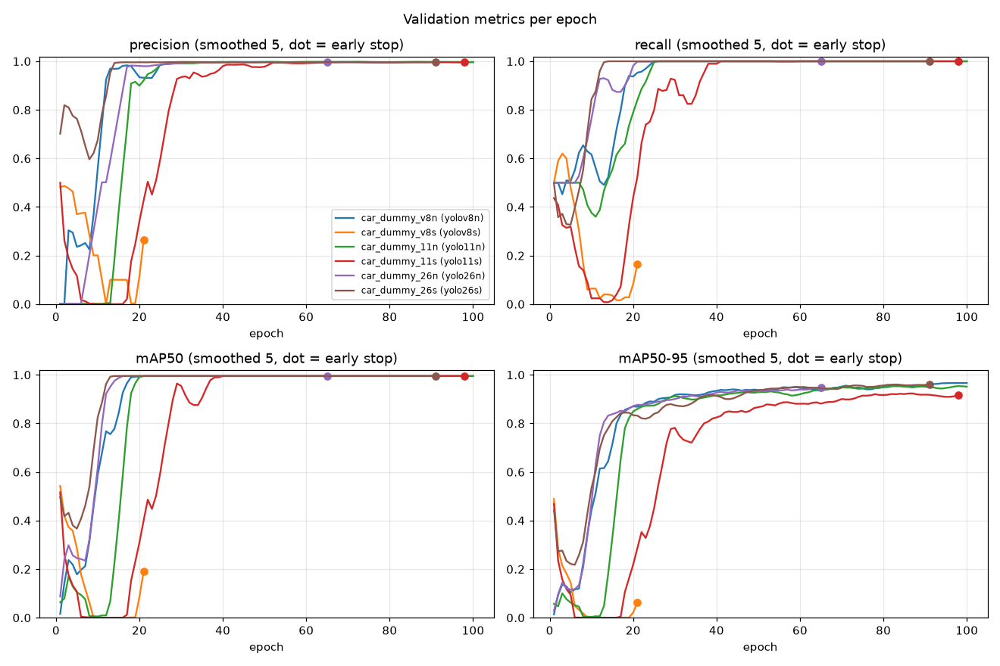

- **n 모델**(v8n, 11n, 26n)은 10~20 epoch에 mAP50이 0.99에 도달하고, mAP50-95는 epoch 30 이후 0.9 이상에서 천천히 오릅니다.
- **s 모델**은 사전학습 head 덕분에 epoch 1 점수가 높지만(mAP50-95 ≈ 0.47), warmup으로 lr이 오르는 epoch 2~5에 **0 근처까지 무너졌다가** 회복합니다.
  - YOLO26s는 epoch 6에 회복했고, YOLO11s는 epoch 18에 겨우 회복했습니다.
  - YOLOv8s 1차는 회복 직전에 patience 20을 넘겨 epoch 21에 조기 종료됐습니다(점).
- YOLO26n은 가장 빨리 수렴해서 best epoch 45, 65 epoch에 조기 종료됐습니다.

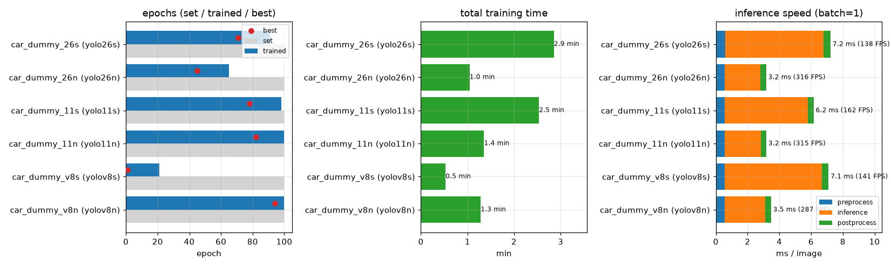

### 4.2 test 성능과 속도/크기

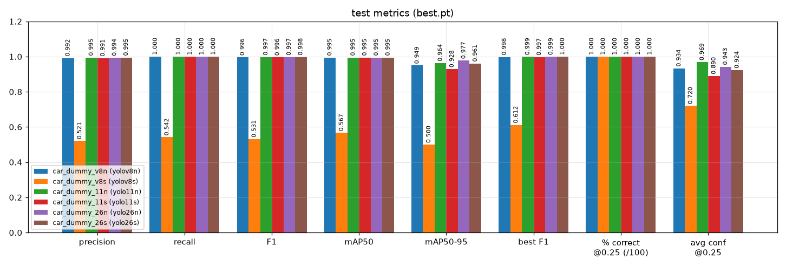

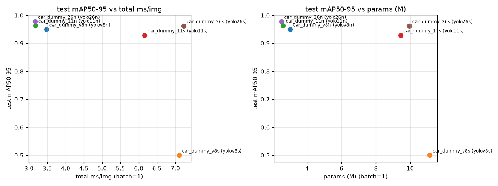

- 왼쪽 위(빠르고 정확)에 n 모델 3개가 몰려 있습니다. s 모델은 2배 느리면서 정확도는 같거나 낮습니다.
- 이 데이터 규모(87장)에서는 **s 모델을 쓸 이유가 없습니다.**

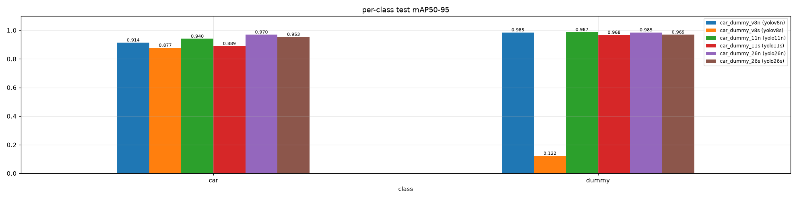

- dummy는 크기·모양이 거의 일정해서 모든 정상 모델이 0.96 이상입니다. 차이는 **car(크기·위치가 다양)**에서 납니다. 26n이 car 0.970으로 가장 높습니다.
- v8s 1차는 dummy를 하나도 검출하지 못했습니다(0.122).

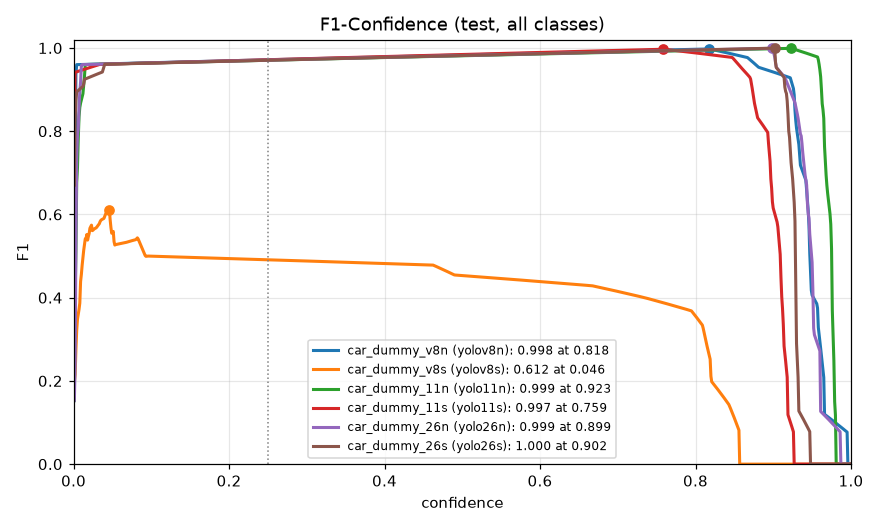

- 정상 모델은 conf 0.05~0.75 구간에서 F1 0.96 이상을 유지하고, 0.8~0.9 부근에서 최고점(0.997~1.000)을 찍은 뒤 떨어집니다. 11s가 가장 먼저(≈0.8), 11n이 가장 늦게(≈0.95) 떨어집니다.

---

## 5. 베스트 모델: YOLO26n

`runs/car_dummy_26n/stats/` · 가중치 `my_best26n.pt`

### 5.1 학습 추이

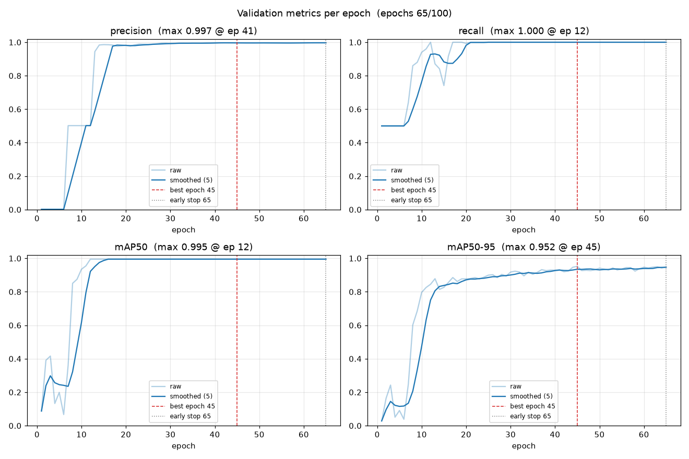

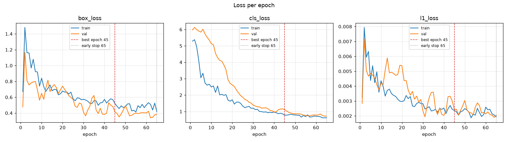

- train/val loss가 함께 내려가고 간격이 벌어지지 않아 **과적합 징후는 없습니다.**
- epoch 2에 box_loss가 튀는 것은 warmup으로 lr이 오르는 구간이며, n 모델이라 발산 없이 바로 회복합니다.
- best epoch 45 이후 20 epoch 동안 개선이 없어 65에서 조기 종료됐습니다(이미 수렴한 뒤의 정상 종료).
- YOLO26은 v8/11과 달리 dfl_loss 대신 l1_loss를 씁니다.

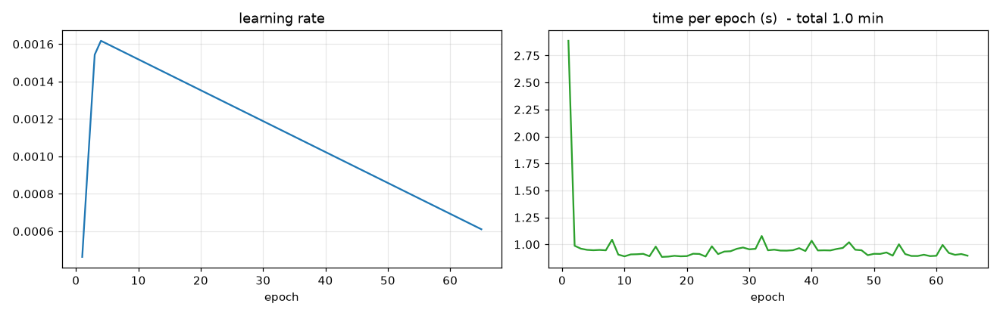

- `optimizer=auto` → AdamW가 선택돼 lr이 warmup 3 epoch 동안 0.0016까지 오른 뒤 선형 감소합니다.
- epoch당 약 0.9초, 첫 epoch만 초기화 때문에 2.9초입니다.

### 5.2 성능 통계

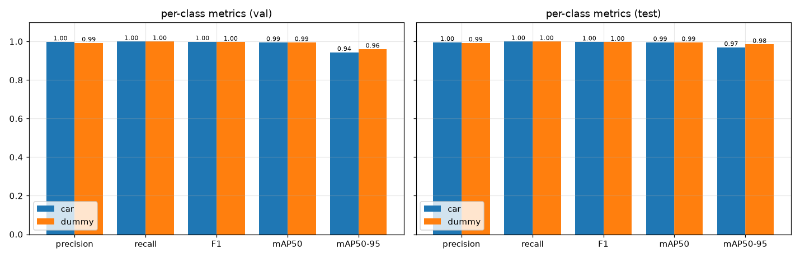

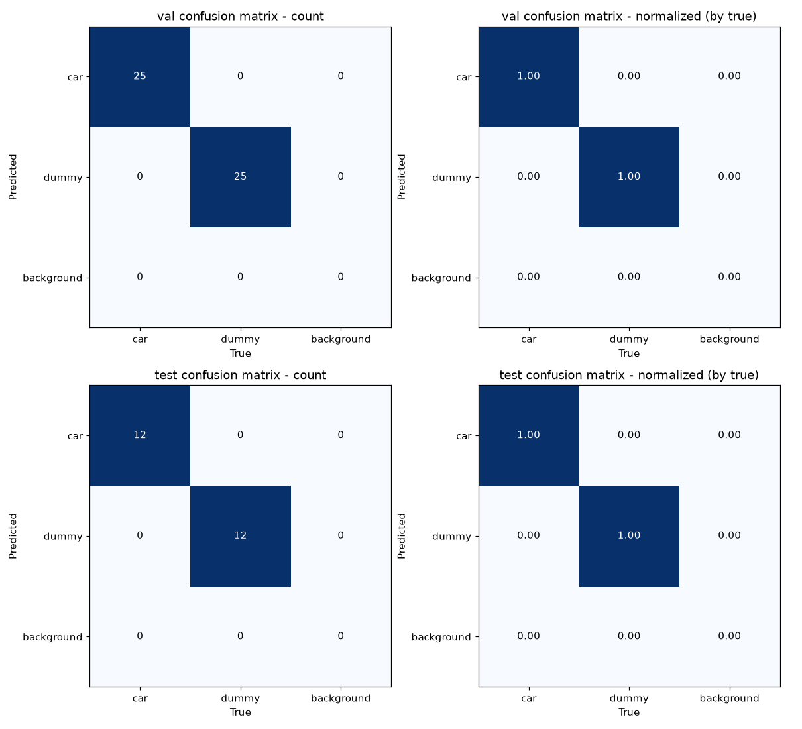

- val(50박스), test(24박스) 모두 **대각 행렬** — 오분류·오탐·미탐 0건입니다.

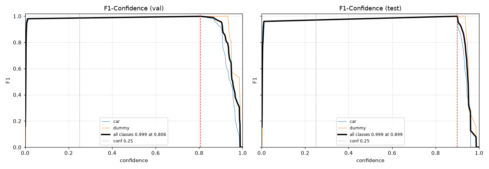

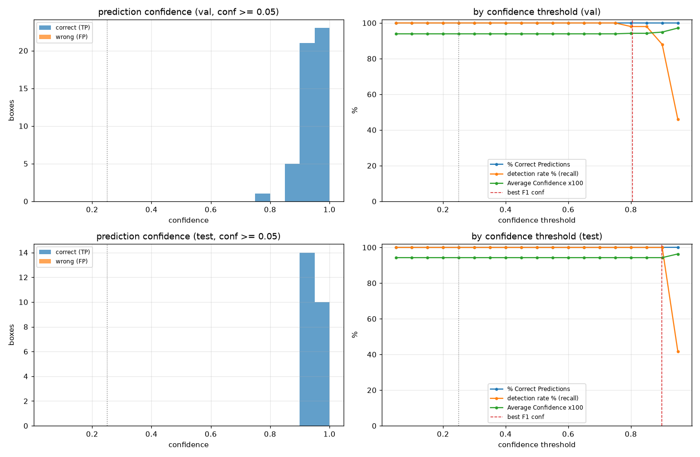

- 모든 예측이 conf 0.75 이상에 몰려 있고 오탐(주황)은 없습니다.
- threshold를 0.85까지 올려도 탐지율 100%가 유지되고, 0.9를 넘으면 급격히 떨어집니다.
  → **배포 시 `conf=0.5` 정도면 충분히 안전**하고, best F1 conf는 test 기준 0.899입니다.

### 5.3 데이터 통계

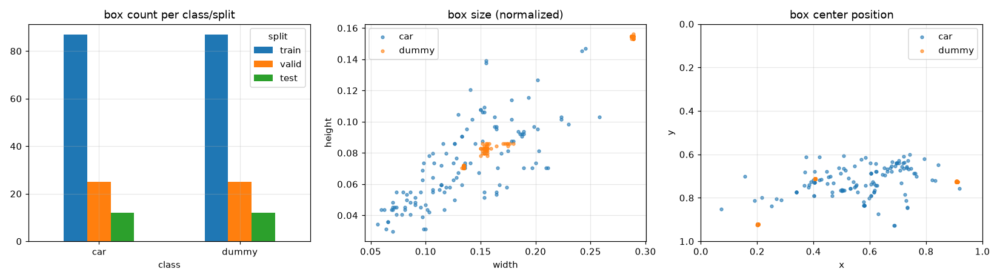

- 클래스별 박스 수는 train 87 / valid 25 / test 12로 균형입니다.
- dummy는 박스 크기와 위치가 몇 군데에 몰려 있습니다(고정 위치 촬영). 다른 위치·거리의 dummy에는 일반화가 약할 수 있으니, 실제 환경에서 오탐·미탐이 보이면 해당 장면을 추가로 수집하세요.

### 5.4 예측 예시

| val 정답 | val 예측 |
|---|---|
| 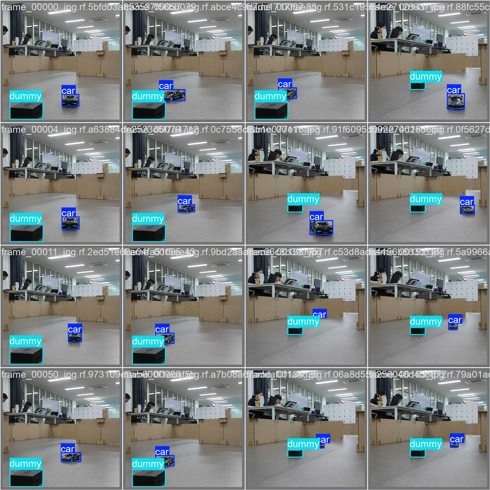 | 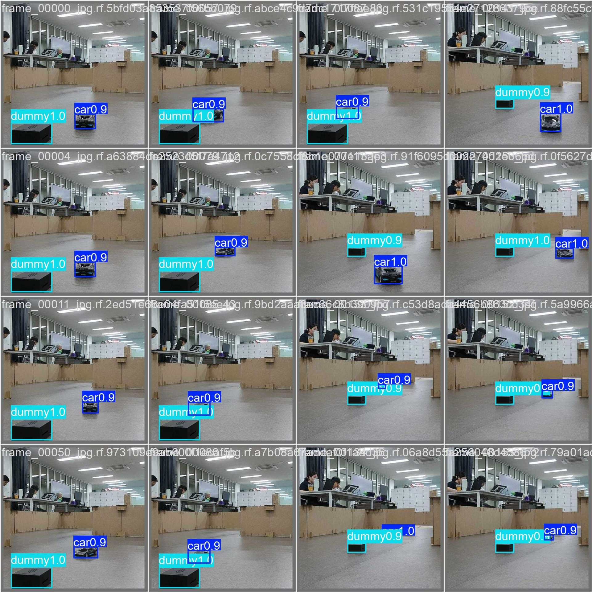 |

트래킹 결과 영상: `runs/car_dummy_26n_track/track_test.avi`

---

## 6. 참고: YOLOv8s 발산과 재학습

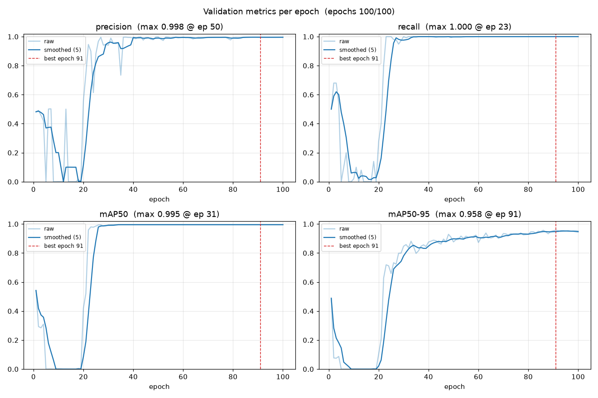

- 1차(patience 20)에서 epoch 2~19 동안 지표가 0으로 떨어지고(val cls_loss 최대 3164, 일부 NaN), epoch 1의 점수를 넘지 못해 epoch 21에 조기 종료됐습니다.
- seed가 고정돼 2차(patience 50)도 같은 발산이 재현됐지만, **epoch 22부터 회복**해 test mAP50-95 0.9533까지 올라갔습니다.
- 원인은 소규모 데이터(epoch당 6 iteration) + 자동 선택된 AdamW lr + s 모델 조합입니다.
  `optimizer='SGD', lr0=0.005, warmup_epochs=5, freeze=10` 등 개선 실험 계획은 [YOLO_TRAINING_REPORT.md §7](YOLO_TRAINING_REPORT.md)에 있습니다.
